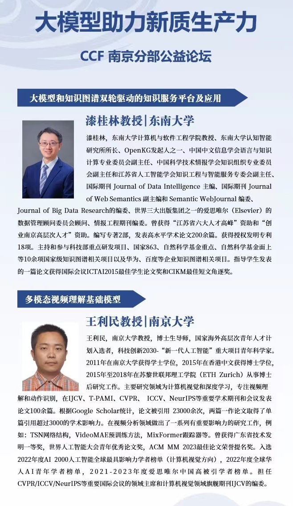

We have organized a forum about language and vision big model in Hohai University, Jiangning Campus. We have been grateful to invite Professor Guilin Qi from Southeast University and Professor Liming Wang from Nanjing University. Hope to see you in Nanjing.

