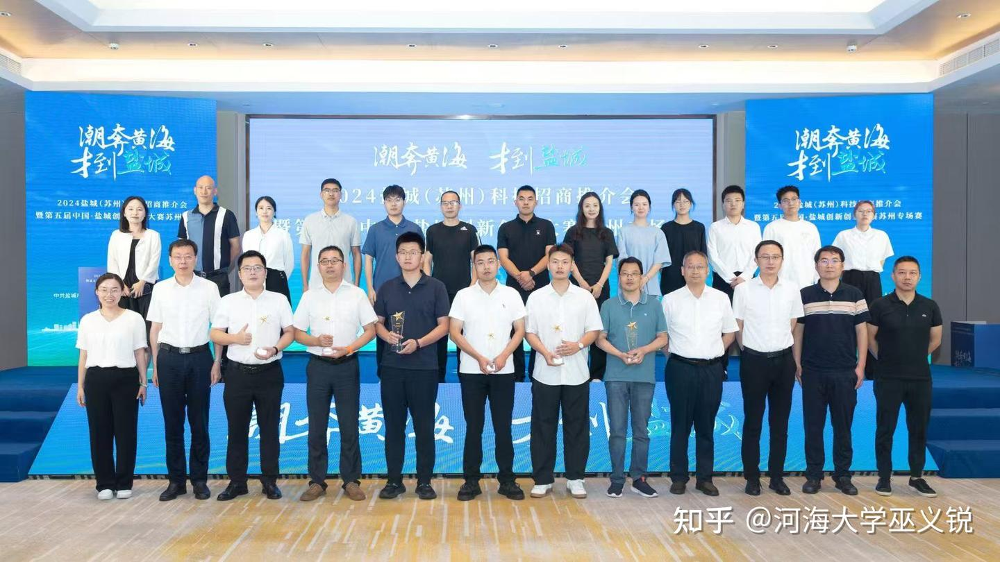
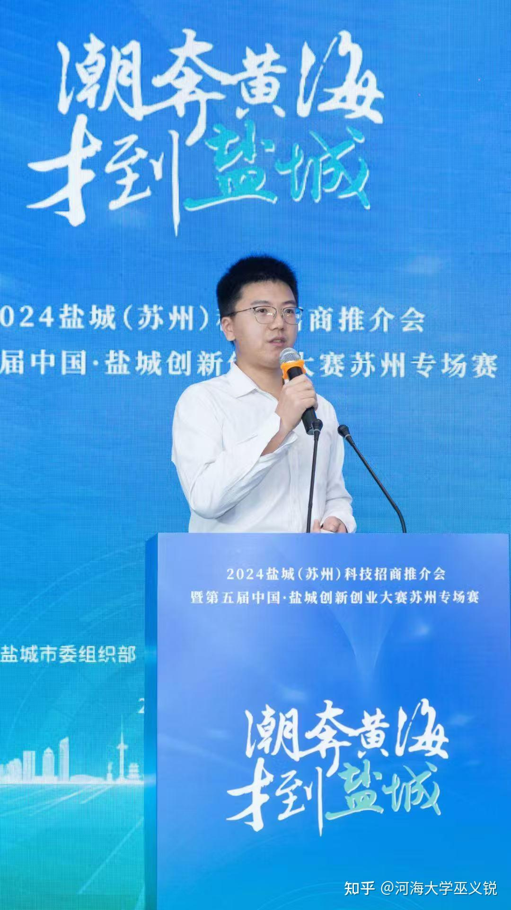

The China Yancheng Innovation and Entrepreneurship Competition, hosted by the Yancheng Municipal Government, aims to promote regional innovation development, attract global talent, and facilitate the transformation of scientific and technological achievements. The competition focuses on multiple high-tech fields and enhances the city's image and economic development through multi-stage selection and diversified support, while also fostering and incubating innovative talent.
<!--more-->
Dr. Liu Xinfu, along with students Jin Xiu and Geng Ao from our lab, presented three industry-academia-research projects at the finals.

