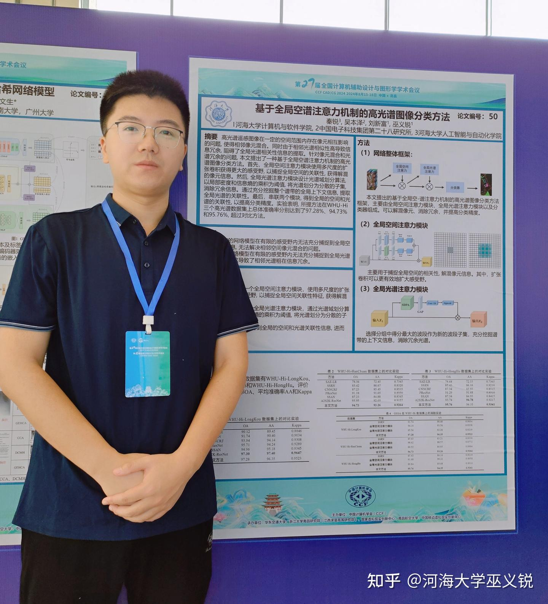

<!--more-->

The 27th National Conference on Computer-Aided Design and Computer Graphics (CCF CAD/CG 2024), organized by the China Computer Federation (CCF) and co-hosted by the CCF Computer-Aided Design and Graphics Committee, East China Jiaotong University, Zhejiang University Nanchang Research Institute (Jiangxi Qiushi Advanced Research Institute), National Virtual Reality Innovation Center, Nanchang University of Aeronautics, and China Mobile Virtual Reality Innovation Center, will be held in Nanchang, Jiangxi, from August 15 to August 18, 2024. This conference will be held concurrently with the 16th National Conference on Geometric Design and Computing (GDC 2024). The conference aims to support the modernization of the industrial chain in Jiangxi under the "1269 Action Plan" and build Nanchang into a high-tech hub for information technology industries. The conference will bring together experts, scholars, technical innovators, and manufacturing pioneers from multiple fields to discuss the innovative applications and development of VR technology in the manufacturing industry.

As a flagship event for the computer-aided design and computer graphics community in China, this conference seeks to accelerate the integration of new-generation information technology with the manufacturing industry, support the digital transformation of manufacturing enterprises, and promote the innovation and popularization of VR technology. The conference aims to introduce intelligent technologies and systems to improve the efficiency and quality of manufacturing and establish Nanchang as a hub for the information technology industry.

The paper co-authored by Dr. Xinfu Liu and Rui Qin from our lab was accepted for an oral presentation at CCF CAD/CG 2024 and has been recommended to the Journal of Shanghai Jiao Tong University.

