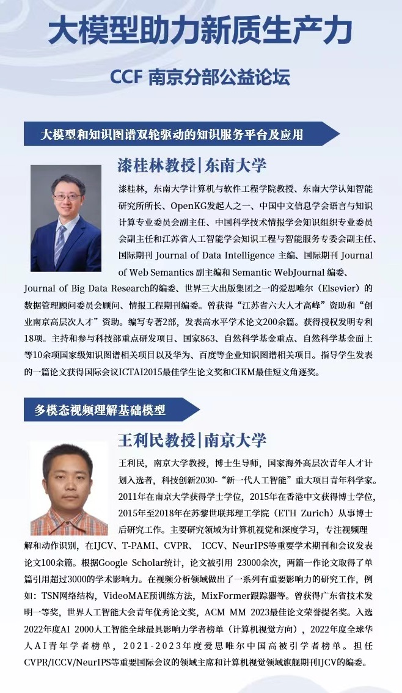
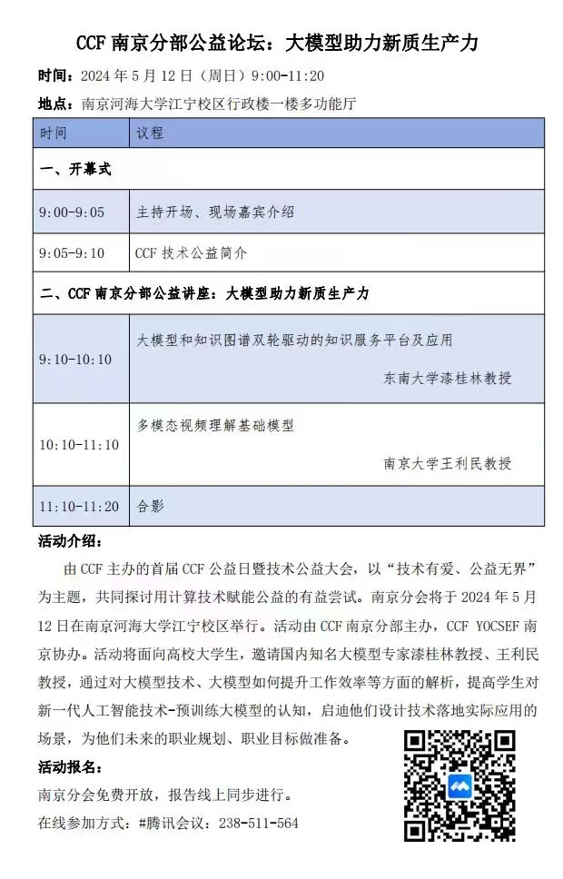

由CCF南京分部主办的，CCF YOCSEF南京协办的CCF 南京分部公益论坛：大模型助力新质生产力，将于2024 年 5 月 12 日（周日）9:00-11:20在河海大学江宁校区行政楼一楼 多功能厅举行。活动面向高校大学生，邀请到了国内知名大模型专家，东南大学漆桂林教授、南京大学王利民教授，对自然语言和视觉大模型技术的当下与 未来发展脉络做技术报告，提高学生对新一代人工智能技术-预训练大模型的认知，启迪他们设计技术落地实际应用的场景，为他们未来的职业规划、 职业目标做准备。欢迎各位学术界、工业界小伙伴以及同学们现场参与。

