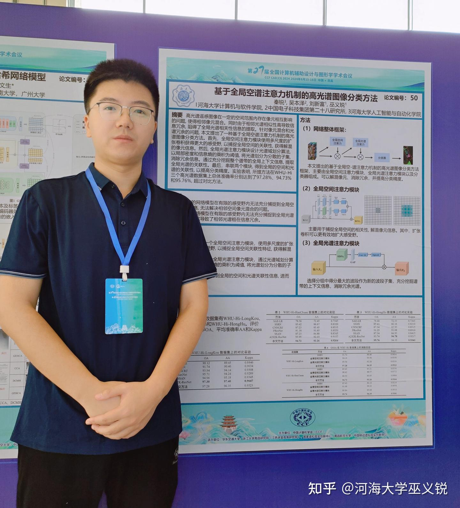

<!--more-->

由中国计算机学会(CCF)主办，CCF计算机辅助设计与图形学专业委员会、华东交通大学、浙江大学南昌研究院（江西求是高等研究院）、国家虚拟现实创新中心、南昌航空大学、中国移动虚拟现实创新中心共同承办的第27届全国计算机辅助设计与图形学学术会议（CCF CAD/CG 2024）将于2024年8月15日至8月18日在江西南昌举行。此次会议将与第十六届全国几何设计与计算学术会议（GDC 2024）同期同地举办。 助力江西推进产业链现代化“1269行动计划”，打造南昌信息技术产业高地，会议旨在汇聚多个领域的专家学者、技术创新者和制造业先驱，探讨VR产业在制造业中的创新应用与发展。作为中国计算机辅助设计与计算机图形学领域的最高水平旗舰会议，为加快新一代信息技术与制造业相互渗透、相互融合，支持制造业企业数字化转型，推动VR产业的创新和普及，致力于引入智能化的技术和系统，以提高制造业的效率和质量，打造南昌信息技术产业高地。

刘新富博士和秦锐同学合作的论文被CCF CAD/CG2024录用为口头报告论文，并被推荐至上海交通大学学报。

