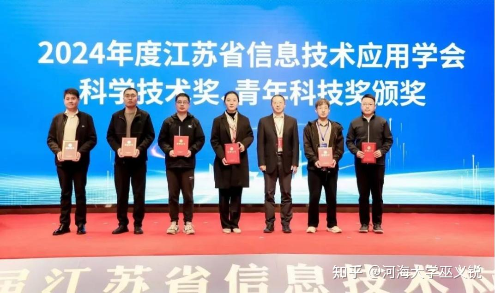

在2024年11月7日于南京大学召开的“第三届江苏省信息技术应用大会”上，巫义锐教授荣获江苏省计算机学会青年科技奖，以表彰其在小样本学习领域的创新性成果。
<!--more-->
此次大会高度重视信息技术科研应用，汇聚省内外高校、科研单位和企业的专家，致力于搭建信息技术领域的多层次合作平台，为技术创新与成果转化注入新活力。巫义锐教授的成果专注于小样本学习的理论拓展、平台设计、落地应用和技术推广，积极主导平台建设、推动技术成果在水利等行业的高效应用，并通过高层学术论坛促进行业融合，推动该领域实现新突破。
