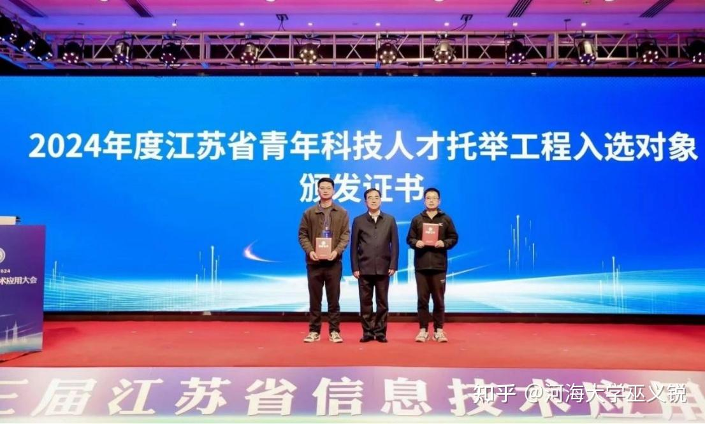

江苏省青年科技人才托举工程（青托工程）是一项旨在培养和选拔优秀青年科技人才的重要人才计划。
<!--more-->
该工程主要面向江苏省内的青年科研人员，特别是年龄在35周岁以下、在自然科学和工程技术等领域具有显著成就和发展潜力的青年。通过提供资金支持、搭建科研平台、组织学术交流和人才培养等措施，青托工程旨在帮助青年科技人才快速成长，成为科技领域的领军人物。自实施以来，青托工程已培养出一批在国内外具有影响力的青年科技人才，为江苏省乃至全国的经济社会发展贡献了重要力量。
